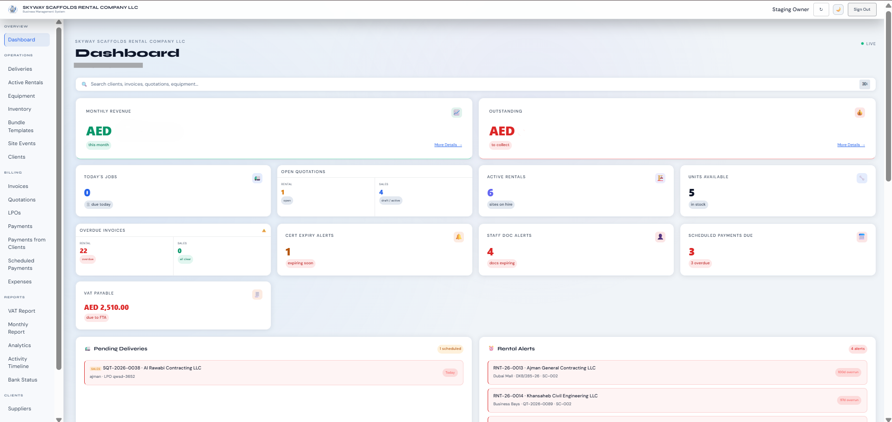
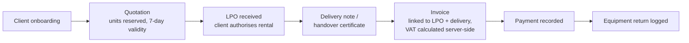
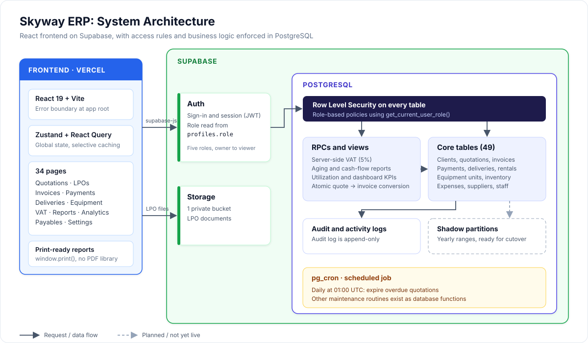
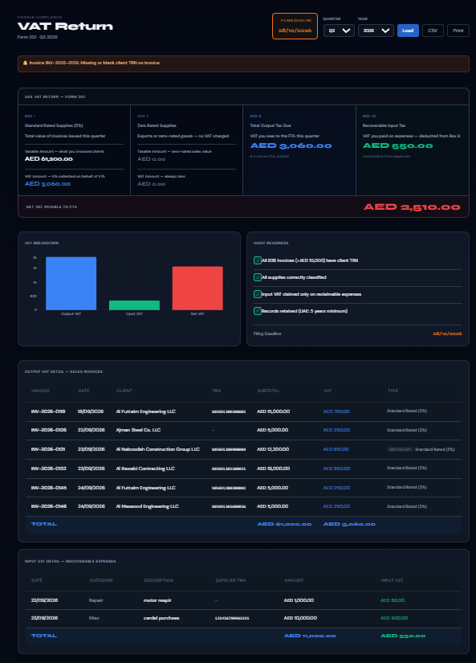
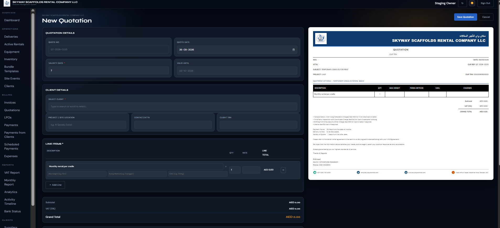
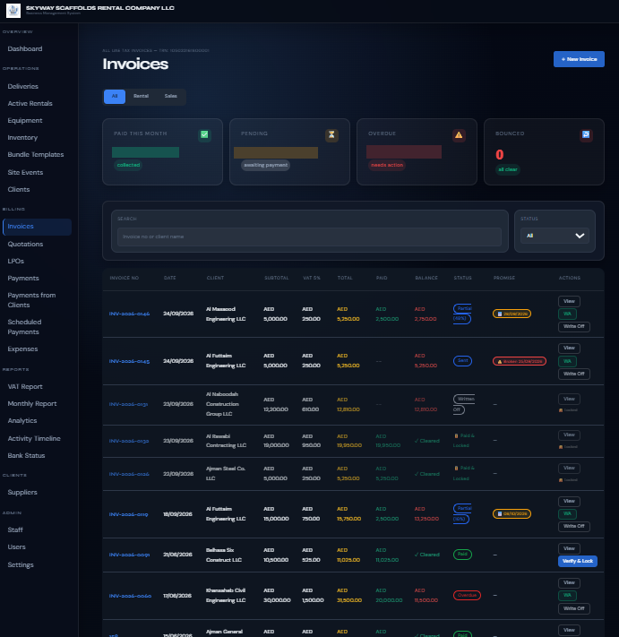
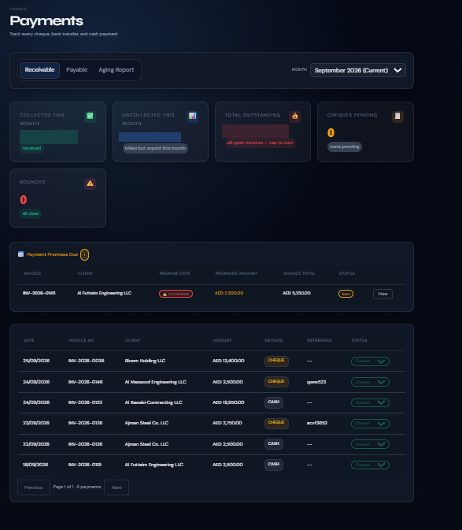

# Skyway ERP

**A production rental management system built for a scaffolding rental company in the UAE, covering the full business lifecycle from client onboarding to VAT reporting.**

-lightgrey)

> **Source code is private.** This repo is a technical case study: the problem, the architecture, the engineering decisions and screenshots. A code walkthrough is available on request.

---

## At a glance

| | |
|---|---|
| **Built for** | Scaffolding rental company, UAE |
| **Status** | Live in production, used daily |
| **Problem** | Quotes, deliveries, invoices and payments lived in spreadsheets and paper |
| **Solution** | One system covering the full rental cycle, with UAE VAT built in |
| **Frontend** | 34 pages across rentals, finance, equipment and reporting |
| **Database** | 49 tables, 100+ SQL functions, Row Level Security on every table |
| **Quality** | 80/80 automated tests passing; 39-issue security and bug audit |

## The business problem

A scaffolding rental company juggles:

- Equipment scattered across dozens of active sites
- Quotes that expire and need units released automatically
- UAE VAT compliance on every invoice
- Clients who pay late, with aging tracked by days since invoice
- Delivery drivers who need dispatch orders on their phone
- Owners who need the full financial picture in one place

Every screen, database function and scheduled job exists because a real business process required it.

---

## What was built

### The rental lifecycle, end to end

Financial records are never deleted; they change status only. Every transition is audited.

### Features at a glance

**Operations**
- Quotation builder with live line-item totals and automatic VAT
- LPO intake locks the quote and generates a delivery note
- Handover certificate with component checklist and digital signature capture
- Delivery dispatch orders with driver assignment, vehicle, and photo upload
- Equipment return logging with damage reporting

**Finance**
- Invoice approval workflow (draft, pending, approved, paid)
- Split payment recording: cheque, bank transfer, cash
- Aging report in 0-30 / 31-60 / 61-90 / 90+ day buckets
- Cash flow forecast from outstanding invoices
- UAE VAT report (5% output / input) for any date range
- Statement of account per client
- Expense tracking with VAT-reclaimable flag

**Equipment**
- Serialised unit tracking: every scaffold unit has its own record
- Status lifecycle: available, reserved, on rent, repair, maintenance
- Inspection certificate expiry tracking
- Utilisation report: percentage of fleet currently on rent

**Reporting and dashboard**
- Live KPI dashboard: revenue, outstanding, overdue, active rentals
- Revenue vs expenses chart and invoice status chart
- Monthly report with screen and print views
- Reports print via `window.print()`, with no PDF library dependency

**Access control**
- Five roles: `owner`, `manager`, `accountant`, `driver`, `viewer`
- Row Level Security on every table, with role-based policies enforced in the database
- Owner approval required before new user accounts activate

---

## Architecture

Business rules such as VAT, status changes, and quote-to-invoice conversion live in Postgres RPCs and views, so they behave the same whichever screen triggers them.

---

## Engineering highlights

### Atomic database operations
Quote conversion, invoice creation and inventory status updates run inside single Postgres transactions. There is no state where a quote is "converted" but its units still show as reserved, or an invoice exists without its line items.

### Server-side VAT
UAE 5% VAT is calculated inside the RPC on every insert and update, not in JavaScript. VAT figures stay consistent regardless of which client or API path created the record.

### Scheduled quotation expiry
A `pg_cron` job runs daily at 01:00 UTC and expires quotations past their validity. Expiry releases the units reserved against a quotation, so equipment does not stay blocked by quotes nobody acted on.

### Partitioned shadow tables
`invoices`, `quotations` and `deliveries` have `_partitioned` shadow tables using PostgreSQL range partitioning by `created_at`, with yearly child tables pre-built through 2044. They are built alongside the live tables because Supabase does not support in-place `PARTITION BY` conversion. Cutover is a planned rename swap.

### Immutable financial records
Financial records are never deleted; they change status only. Activity is logged by database triggers on the core tables, and a trigger on the audit log blocks any update or delete, so the history is append-only.

### Quality baseline
- 80 automated tests passing (80/80)
- 39-issue security and bug audit
- React `ErrorBoundary` at the app root, so a rendering error shows a recovery screen instead of a blank page

---

## Database at a glance

**49 tables** across rentals, sales, finance, equipment, inventory and audit, plus partitioned shadow tables reserved for future cutover.

The full table list, RPC groups and scheduled jobs are in [`docs/schema.md`](docs/schema.md).

---

## Tech stack

| Layer | Choice |
|---|---|
| Frontend | React 19 + Vite, Tailwind |
| State | Zustand + React Query |
| Backend | Supabase: PostgreSQL, Auth, Storage |
| Automation | pg_cron |
| Deploy | Vercel |

---

## Screenshots

> Client names, prices and VAT numbers are blurred or replaced.

### Dashboard
Live KPIs for revenue, outstanding balances, active rentals, overdue invoices, expiry alerts and VAT payable, with pending deliveries and rental alerts below.

### UAE VAT Return (Form 201)
Box-by-box VAT return for any quarter, with an audit-readiness checklist, output VAT detail per invoice, and recoverable input VAT from expenses. Exports to CSV.

### Quotation builder
Line-item entry with automatic VAT and a live preview of the customer-facing quotation.

### Invoices
Rental and sales invoices with paid, balance and status tracking. Paid invoices are locked, and financial records are never deleted.

### Payments
Cheque, bank transfer and cash tracking, with payment promises due and bounced-cheque monitoring.

---

## Author

**Syed Nomaan Uddin**
[LinkedIn](www.linkedin.com/in/syednomaanuddin523) · [Email](mailto:syednomaan.work@gmail.com) · 

*Source is private. Available for walkthrough or screen-share on request.*
