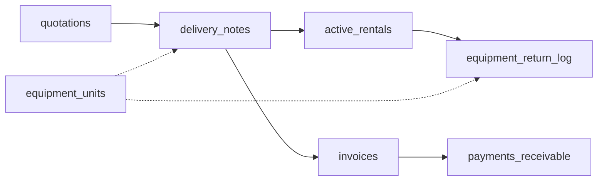

# Database overview

Structure only. No data, credentials or client identifiers. PostgreSQL on Supabase.

| Object | Count |
|---|---|
| Tables | 49 |
| SQL functions / RPCs | 100+ |
| Row Level Security | Enabled on every table |
| Scheduled jobs (pg_cron) | 1 (daily quotation expiry) |
| Partitioned shadow tables | 3, yearly child tables through 2044 |

## Tables by domain

| Domain | Tables |
|---|---|
| Sales | `quotations`, `quotation_items`, `sales_orders`, `sales_quotations`, `sales_lpos`, `sales_delivery_notes` |
| Billing | `invoices`, `invoice_items` |
| Payments | `payments_receivable`, `payments_payable`, `obligation_types`, `obligation_definitions` |
| Deliveries | `delivery_notes`, `delivery_items`, `deliveries`, `delivery_components_master` |
| Rentals | `rentals`, `rental_items`, `active_rentals`, `rental_extensions` |
| Equipment | `equipment`, `equipment_units`, `equipment_unit_components`, `bundle_templates`, `bundle_template_items` |
| Equipment lifecycle | `inspection_records`, `equipment_return_log`, `equipment_status_history` |
| Inventory | `inventory`, `inventory_movements`, `inventory_reservations` |
| Finance | `expenses` |
| People and access | `clients`, `suppliers`, `staff`, `profiles`, `access_requests` |
| Operations | `tasks`, `task_activity`, `company_settings` |
| Compliance and history | `audit_logs`, `activity_logs_v2`, `approval_history`, `entity_history`, `legal_documents`, `site_events` |

## Main flow

## Roles

`owner`, `manager`, `accountant`, `driver`, `viewer`. Row Level Security policies check the caller's role through a database function, so access rules live in one place.

## RPC groups

| Group | Examples |
|---|---|
| Documents | quotation to invoice conversion, delivery creation, invoice approval |
| Finance | payment recording, VAT report, aging report, cash-flow forecast, statement of account |
| Equipment | availability checks, reservations, returns, status changes with history |
| Numbering | sequential invoice, quote, delivery and rental numbers |
| Dashboard | KPIs, recent activity, equipment alerts, utilization |

## Audit trail

Activity triggers on the core tables write to the activity log. A trigger on `audit_logs` blocks updates and deletes, so the audit history is append-only.

## Scheduled job

| Job | Schedule |
|---|---|
| Expire overdue quotations | Daily, 01:00 UTC |
